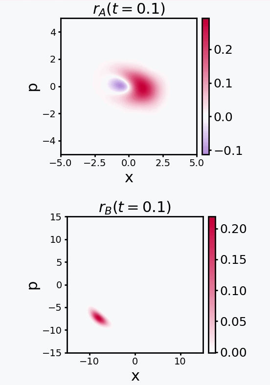

# Dissipative Time Crystals as Passively Protected Oscillating Qubits
Numerical simulations and Liouvillian spectral analysis of dissipative time crystals and passive quantum error protection in the driven-dissipative Bose–Hubbard dimer.

  

